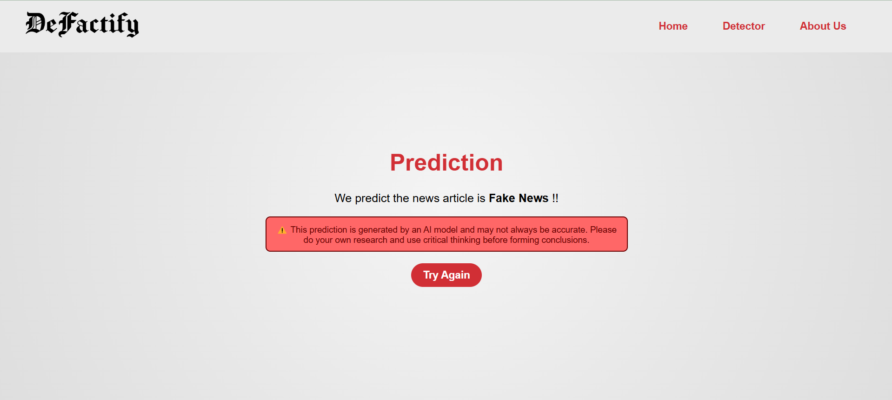

# DeFactify - Fake News Detection

DeFactify is a university project aimed at restoring trust in journalism by detecting fake news using machine learning. It helps users distinguish between true and fake news articles based on content and title analysis.

## 🔍 How It Works

The core of DeFactify is a **Stacking Classifier** model with an **SVM as the meta-model**, achieving **94.15% accuracy**. It analyzes the patterns in news data to provide clear results: **True** or **Fake**.




## 🧠 Why It Matters

Misinformation spreads fast. DeFactify not only provides detection tools but also promotes critical thinking. Trust is essential — but so is skepticism. We encourage users to question what they read and make informed judgments.

## 🎯 Project Goal

This project was developed as part of a university initiative to:
- Restore trust in journalism.
- Promote media literacy.
- Leverage machine learning for social good.

## 🚀 Getting Started

1. Clone the repo:
   ```bash
   git clone https://github.com/ivetkalchev/DeFactify
   cd DeFactify
